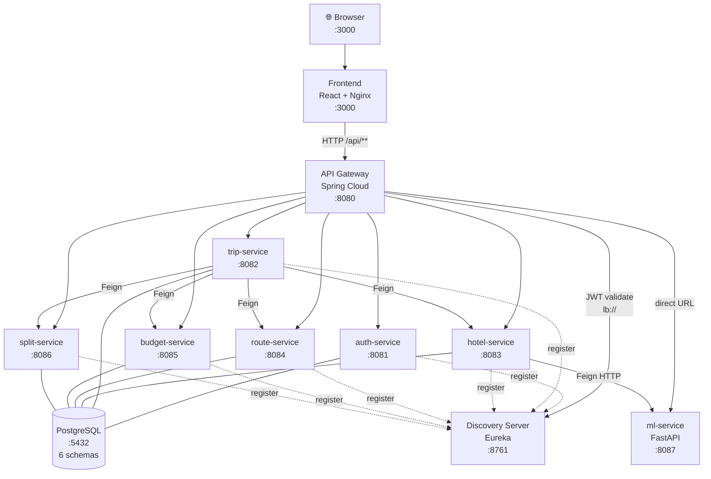
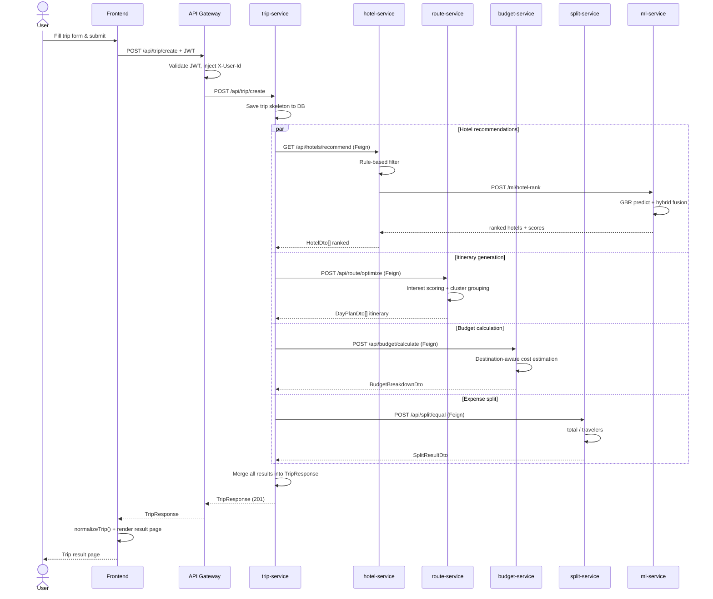
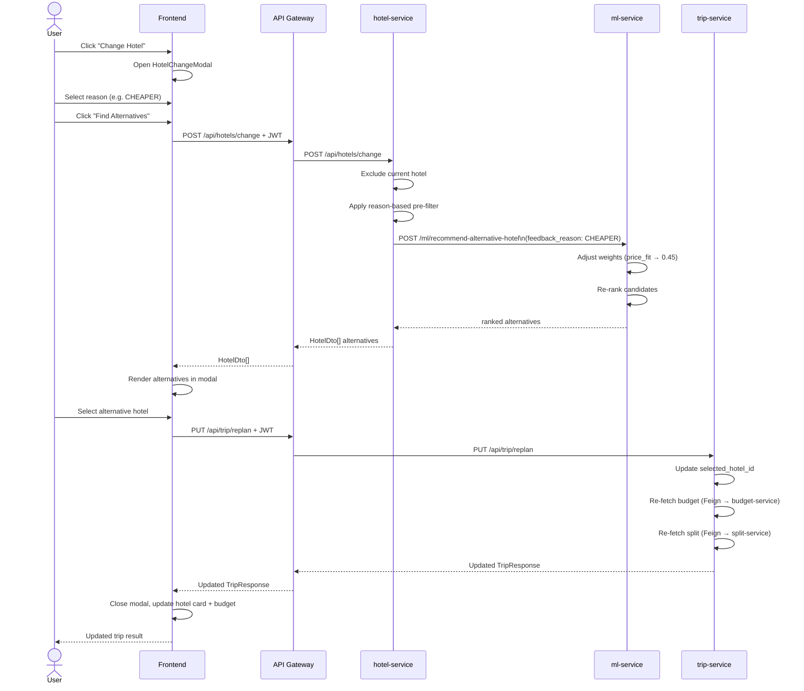
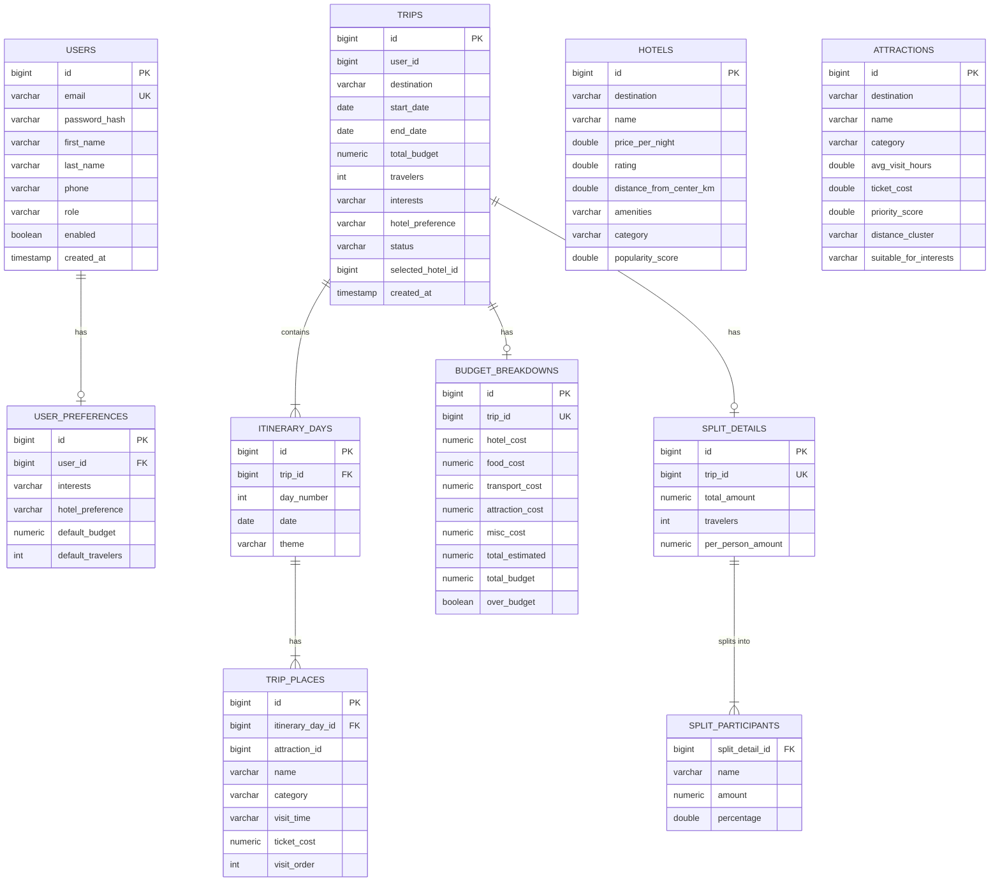
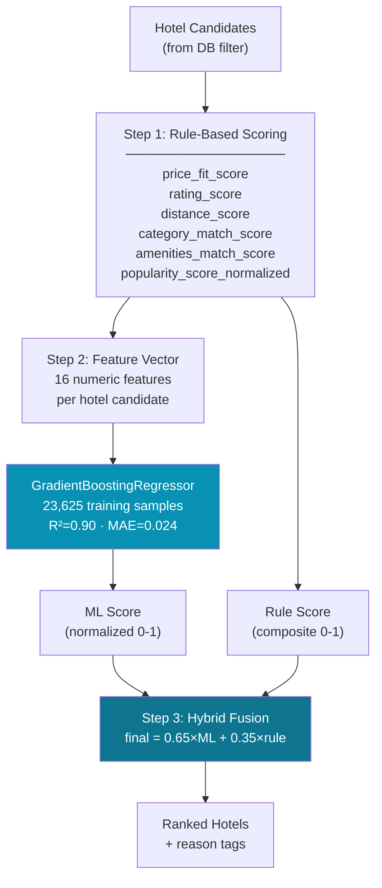

# TripForge — Architecture & Sequence Diagrams

---

## 1. System Architecture Diagram

---

## 2. Sequence Diagram: Create Trip

---

## 3. Sequence Diagram: Change Hotel

---

## 4. ER Diagram

---

## 5. ML Pipeline Diagram

